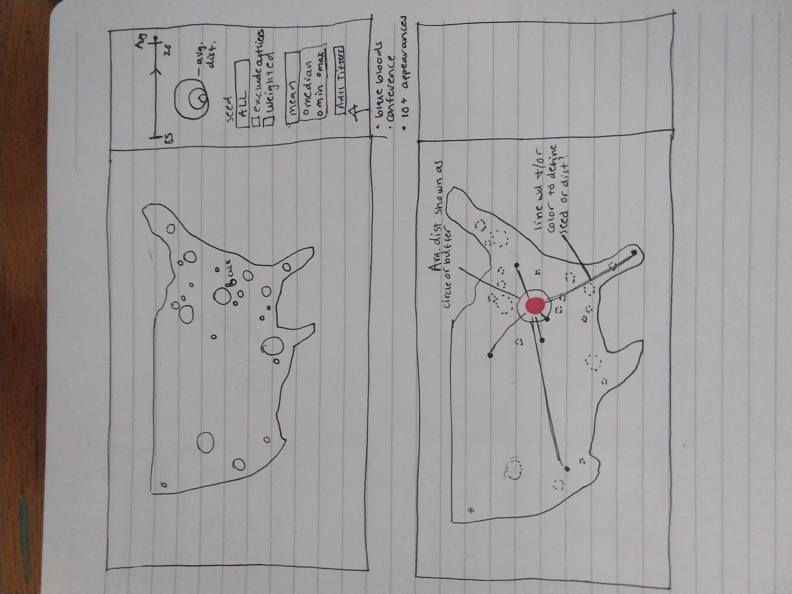
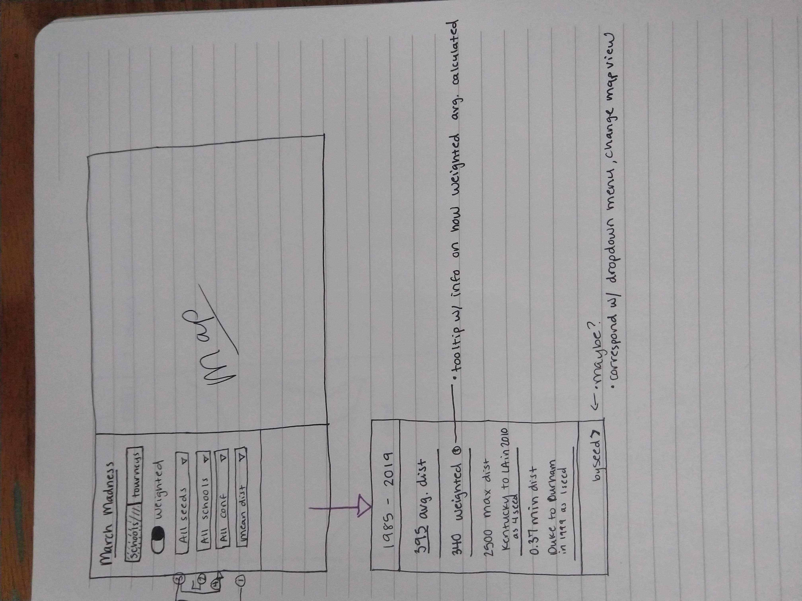
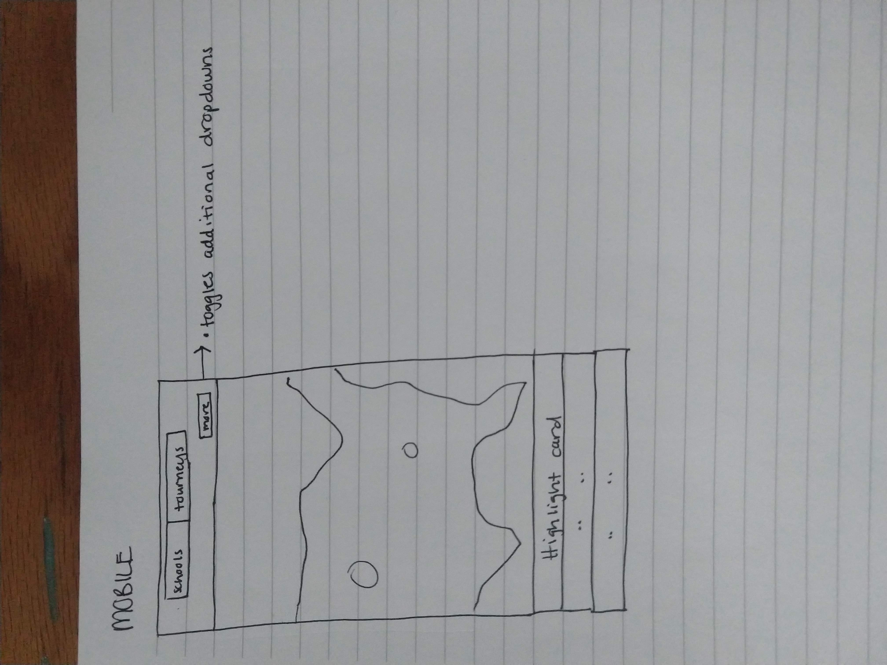
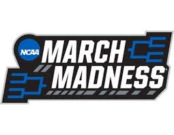
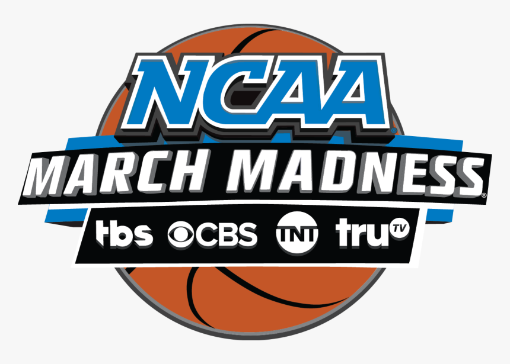

# March Madness Top 4 Seeds and First Round Site Preference (1985-2019)

## I. Introduction

Every year in March, the top 68 Division 1 men's college basketball programs are selected to compete for the NCAA's 
national championship title in a single-elimination competition colloquially called March Madness. While the selection 
process and tournament format for March Madness have changed considerably since its inception in 1939, countless fans 
have become devoted to understanding and predicting the tournament field in the study of 'Bracketology.' The modern era 
of the tournament began in 1985 with a final field of 64 teams and preferential seeding to determine the year's bracket.

In theory, higher ranked teams are rewarded by playing the lowest ranked teams in the tournament. Furthermore, according
to the NCAA's selection process, top seeded teams are to have geographic preference over lower seeded teams in the first
two rounds of the tournament (if possible - other factors are considered). **I want to analyze the first/second round 
sites for each of the top 4 seeded teams (four teams in each seed for 16 total top teams each year) from 1985 to 2020 to 
establish patterns, potential biases, and test the NCAA's claim of geographic preference.**

Obsessed with so-called 'chaos,' college basketball fans thrive on the unpredictability of the first and second rounds of 
the NCAA tournament. While higher ranked/seeded teams are expected to make deep runs, it is not uncommon for them to get upset 
by lower ranked teams ([sorry UVA fans](https://www.usatoday.com/story/sports/college/columnist/dan-wolken/2018/03/17/umbc-virginia-upset-jairus-lyles-ncaa-tournament/434704002/)).
Teams want every advantage they can entering the first weekend of the tournament. The advantage of playing at a site 
closer to the school location is both pragmatic and psychological. The players are still attending classes, so it is 
logistically easier to travel shorter distances. Furthermore, playing closer to the school allows the team's fan base
and families a better opportunity to watch them play, giving them as much of a [home court advantage](https://kenpom.com/blog/mining-point-spread-data-home-court-advantage/) as possible. 

### A. Literature Review

* [NCAA Has a Geography Problem](https://www.thebiglead.com/2019/02/10/the-ncaa-tournament-has-a-geography-problem-and-should-move-a-western-venue/)
* [Home Team Bias in Bracket Predictions](https://www.cbssports.com/college-basketball/news/homer-bias-is-real-and-it-will-derail-your-march-madness-bracket/)
* [East Coast Bias in March Madness Selection](https://honors.libraries.psu.edu/catalog/14064)
* [Eastern Bias](https://www.usatoday.com/story/sports/ncaab/2018/03/15/ncaa-tournament-has-curious-eastern-slant-bias/429897002/)
* [Making March Madness](https://books.google.com/books?id=zHsnDwAAQBAJ&pg=PA231&lpg=PA231&dq=march+madness+geographical+bias&source=bl&ots=sowe_VDUU4&sig=ACfU3U0rGr27TqR1NsO5Ygxv84bCcB7tug&hl=en&sa=X&ved=2ahUKEwiK9Lqlq9HnAhWHVN8KHTEYAIAQ6AEwCHoECAsQAQ)
* [Home Court Advantage Analysis](https://www.boydsbets.com/college-basketball-home-court-advantage/)

## II. Methodology

Data were primarily pulled from [sports-reference.com](https://www.sports-reference.com/cbb/postseason/) and subsequently
cleaned, manipulated, and analyzed with various Python 3 packages via Jupyter Notebooks. QGIS was also utilized for 
initial case studies for project feasibility and converting to properly formatted geojsons. The primary Python 3 packages
used include:

- [Pandas](https://pandas.pydata.org/)
- [Geopandas](https://geopandas.org/) 
- [Geocoder](https://geocoder.readthedocs.io/) 

### A. Data

#### Raw Tournament Data

Raw data for the first round of each tournament from 1985 to 2019 was copied into a CSV with the year as the column name 
and the first round teams, seeds, sites, and scores as the rows. The raw data was then imported in a Jupyter Notebook 
(`notebooks/data-prep.ipynb`) and cleaned with a Python 3 script resulting in a CSV formatted as:
- 5 columns (seed, school, site, year, id)
- `seed` column is the numeric seed value for each team (1, 2, 3, or 4)
- `school` is the shorthand name for each participating school (e.g. UNC instead of University of North Carolina)
- `site` is the city and state of each school's first round site location (formatted as full city name and state 
abbreviation, e.g. Columbus, OH)
- `year` is the tournament year
- `id` is a unique ID for each school and its associated site for each year's tournament

In addition to each of the 16 teams for years 1985-2019, new rows for each site were appended to the CSV (with a 
matching ID) to eventually analyze the distance between each school and their first-round sites. This data was saved as 
`data/raw/mm-85-19-cleaned.csv`.

This data will be used to calculate the distance between each school and its site location.

#### School Locations and Metadata

The cleaned tournament file includes the shorthand school names, but no other geographic information for participating 
programs. To get locations and other relevant metadata (conference, team mascot, etc.) for each school, the list of 
[NCAA Division 1 Institutions](https://en.wikipedia.org/wiki/List_of_NCAA_Division_I_institutions)
was pulled from Wikipedia and saved as CSV (`data/raw/d1-master-list.csv`). The data was cleaned using Pandas in Python 3
(`notebooks/school-metadata-merge.ipynb`) and merged with the original tournaments file (`data/cleaned/tourney-metadata.csv`).

In addition to the above data columns, the `tourney-metadata` CSV includes the following data columns:
- `school_full_name` is the official school name (e.g. University of California Los Angeles instead of UCLA)
- `team` is the school mascot 
- `city` is the school's city
- `state` is the school's state	
- `type` is the type of institution, e.g. private or public
- `conference` is the NCAA conference that the team belongs to, e.g. Southeastern Conference

#### Geocoding

Having the school and site locations is only the first step in determining the distance between the two. 
These location addresses must be geocoded to find their latitude and longitude, which can then be used to calculate the 
distances. First, the school addresses and site locations must be concatenated into a single string to create a generic 
address, e.g. Gonzaga University Spokane Washington. For schools, the `school_full_name`, `city`, and `state` columns are 
concatenated. For the site locations, the original data (the city and state) is copied over directly.

Because geocoding is a time consuming process and an open source tool is being used, the inputs should be limited as 
much as possible. To reduce the number of addresses to geocode, the dataset can be filtered for only the unique addresses 
and merged back into the full dataset.

Leveraging the Python 3 [geocoder](https://geocoder.readthedocs.io/) package, each unique location is passed 
into the open source [OpenStreetMap](https://geocoder.readthedocs.io/providers/OpenStreetMap.html) geocoder 
(`notebooks/geocode.ipynb`). Once geocoding failures are identified, they are manually fixed and run again, resulting in 
a full geocoded dataset (`data/cleaned/geocoded_results.csv`). 

#### Distance calculation

Having the school and site location coordinates, distances can be calculated between the two for each data point 
(`notebooks/distance-calculation.ipynb`). The full geocoded dataset was imported and converted to a Geopandas geodataframe 
with the Universal Transverse Mercator 14N coordinate reference system. Matching the school location with the site through 
the matching id, distance was calculated between the points. The school and site datasets were saved as separate CSVs, 
`data/cleaned/distance-schools.csv` and `data/cleaned/distance-sites.csv`.

#### Analysis

More coming soon.

#### Sources

Seeding and Selection Process:
* [Historical NCAA March Madness statistics](https://www.sports-reference.com/cbb/postseason/)
* [Selection Committee Rules](https://www.ncaa.com/news/basketball-men/article/2018-10-19/how-field-68-teams-picked-march-madness)

Tournament Statistics:
* [Scores and Seeds 1985-2019](https://data.world/michaelaroy/ncaa-tournament-results/workspace/file?filename=Big_Dance_CSV.csv)
* [Region, Seeds, and Scores 1985-2016](https://data.world/sports/ncaa-mens-march-madness/workspace/file?filename=NCAA+Mens+March+Madness+Historical+Results.csv)
* [Region, Seeds, and Scores 1985-2018](https://data.world/sportsvizsunday/april-ncaa/workspace/file?filename=NCAA+Mens+Basketball+Results.csv)

Style:
* [Team colors 1](https://en.wikipedia.org/wiki/Module:College_color)
* [Team colors 2](https://teamcolorcodes.com/ncaa-color-codes/)
* [Team colors 3](https://usteamcolors.com/ncaa-division-1/)

Interactive Sports Maps:
* [College Football Fanbases](https://www.nytimes.com/interactive/2014/10/03/upshot/ncaa-football-map.html#5,42.944,-91.752)
* [All D1 College Basketball Teams](https://www.google.com/maps/d/u/0/viewer?dg=feature&ie=UTF8&oe=UTF8&msa=0&mid=1bXEv7hQrqKE6DccLudQ-oywpdZ0&ll=35.710909718852356%2C-113.24631124999996&z=4)
* [CBB Player Hometowns (app defunct)](http://www.thepostgame.com/every-ncaa-basketball-players-hometown-map)
* [North American Professional Championships](http://www.slate.com/articles/sports/sports_nut/2012/05/sports_championship_map_explore_every_championship_in_the_history_of_mlb_the_nba_the_nhl_and_the_nfl_.html)

Other Scrollytelling Maps:
* [Ridgecrest, CA Earthquakes](https://www.nytimes.com/interactive/2019/07/19/us/california-earthquakes.html)
* [Midwest Flooding](https://www.nytimes.com/interactive/2019/09/11/us/midwest-flooding.html?te=1&nl=morning-briefing&emc=edit_NN_p_20190912&section=topNews?campaign_id=9&instance_id=12323&segment_id=16950&user_id=f0e74355e8fe8b3573e180f2b848b4bd&regi_id=80404684tion=topNews)
* [Louisiana Toxic Air](https://projects.propublica.org/louisiana-toxic-air/)
* [Shape of Slavery](https://pudding.cool/2017/01/shape-of-slavery/)
* [North Korea Missile Range](https://www.abc.net.au/news/2017-10-16/north-korea-missile-range-map/8880894)
* [Earthquake Triggers](https://www.williamrchase.com/vizrisk/vizrisk_main/)
* [General Scrollytelling Examples](https://vallandingham.me/scroll_talk/examples/)

### B. Medium for Delivery

The map will be an interactive, web browser-based application. It will have responsive design and be accessible across 
both mobile and desktop devices.

#### Technology Stack

The web application will be written in vanilla Javascript and will utilize various supplemental Javascript libraries and
frameworks. It will leverage HTML, CSS, and Javascript for forming and styling the app.

**Frameworks and Toolkits**

[Bootstrap](https://getbootstrap.com/) will be leveraged to create responsive design and UI components. 
[jQuery](https://jquery.com/) will be used to handle events for elements. 

**Style**

[Google Fonts](https://fonts.google.com/) will be used for the application's font face. *****TBD*****
[Material](https://material.io/resources/icons/?style=baseline) will be used for any icons.

**Map**

The map will be built with [Mapbox GL JS](https://docs.mapbox.com/mapbox-gl-js/api/). It will also leverage 
[Turf.js](http://turfjs.org/) for additional geospatial formatting and analysis.

### C. Application Layout

Initial wireframes included below:

Figure 1 shows the initial mockup of the default view of the web application with the basic functionality of filters and
map interaction.

Figure 2 shows an updated view of the application filters and highlight cards.

Figure 3 shows a simple mobile mockup. The filters will be expandable from the top of the map and the highlight cards 
will be placed at the bottom of the map.

### D. Thematic Representation

Because the main subject matter of the map are point locations (schools and tournament sites) and distances between them,
the primary thematic representation will be proportional circles and linestrings.

On load, each school will be represented as a proportional circle based on its average distance traveled from 1985 to 
2019 (i.e. schools with lower average distances will be represented by smaller circles than schools with higher average 
distances, which will be larger). The user will have the option to filter the data for several different summary 
statistics, such as the minimum and maximum distances traveled. The proportional circle radius will correspond to the 
selected data filter.

Clicking on a school will display all of its site locations as a 1-4 seed from 1985-2019. These site locations will also 
be represented as proportional circles, with higher seeds represented as smaller circles. The site locations will also 
use a sequential color scheme (lighter blue = higher seed, darker blue = lower seed) to further signify the seed of 
each school that tournament year.

The distance of between the selected school and each tournament site is implicitly visualized with a simple linestring
extending from the school to the site. Longer distances will be represented by longer linestrings.

### E. User Interaction

The user will be able to interact with the web application through both the map and other user interface elements. 

**Map**

The map will be fully interactive with various click and mouseover event handlers. The default view of the map will
display all schools that have been a 1-4 seed between 1985 and 2019. The user can click the school locations to toggle 
on the site locations associated with that school. This interaction will also trigger a visual affordance - the selected 
school's proportional circle opacity will increase and the unselected schools will be grayed out.

Clicking a school will also update a highlight card that will display some statistics for that school's tournament site 
analysis. Mousing over features (schools and sites) will also toggle informational popups.

The user can return to the default view of the map by clicking the map icon button.

**Filters**

The user will be able to customize their map selections through a variety of toggle and dropdown filters.

A switch toggle will allow the user to easily select the weighted or unweighted distance analysis; the weighted analysis
adjusts distances based on the seed.

Dropdown menus for filtering options will include:

- Statistics (mean, median, minimum, maximum, etc.)
- Seed (1, 2, 3, 4, all) 
- Conference (ACC, SEC, Big 10, etc.)
- Schools (all schools, additional interesting groupings)

Where applicable, selecting a filter will automatically update the map and vice versa, e.g. if the user selects a school
from the dropdown menu, the map will pan and zoom to that school and its sites as though the user had clicked on the map.

**Highlight Cards**

Each view of the map will have an information card with various highlights. The default view of the map will show 
highlights/statistics for all schools over the 1985-2019 period. Selecting a school will show highlights for only that 
school over the same time period.

**Scrollytelling**

TBD - Currently a consideration, but a story has not been developed yet.

**School/Tournament Toggle**

TBD - May include a toggle to shift between the overall school analysis and a year by year map view of each tournament. 
Not sure if this is valuable enough to devote the time to.

### F. Aesthetics and Design Considerations

The application design will be simple, clean, and sleek. The color schemes will reference the NCAA's official March 
Madness logos, which are variable but consistently utilize blues, oranges, and neutrals (black, white, and gray):

 

The UI will be simple and unfussy. The map itself will have a variety of interactions and affordances, so the rest of 
the application should be kept clean.

### G. Conclusion

It's gonna be fun, y'all.

---

##### Roadmap/Ideas

* Use scrollymapping to show analysis highlights?
* Initial view: every school with a history of 1-4 seeds
* Popup/label with metadata, e.g. closest site, farthest site, average distance traveled as each seed, average distance 
traveled overall, etc.
* Mouseover or click on a school shows lines to each site (perhaps an animation flying to each site in great circle arc?)
* Dropdown or button toggle for each year, cards to show highlights and averages
* Add logos?
* Connect to overall seeding data
* Weighted average for distance and seed, weighted average for western schools?
* Need to consider establishing some sort of weighted average/metric to average seed and distance
* Also need to consider East vs. West bias
    * Create hexbin map with fairly large bins (covering large regions of the US, e.g. Pacific NW, West, Southwest, etc.)
    * Count total number of schools (ALL D1 schools?) within each bin, divide by total to create weight for each region
    * Apply region and weight to distances
* Potentially add final scores, W/L, region, championship site?
* Add heatmap-like underlay for distance to each point?
* Two drop downs - schools, seeds, maybe distance slider? So default view is all schools w avg distance, user can filter 
for all schools as 1, 2, 3, or 4 seed (or all), another dropdown for conference?
* Find significant upsets and correlate/associate with distance?
* Use orange (more than avg) and blue (less than avg) proportional circles at default view - upon clicking school, 
school avg is shown with fill and overall average shown with dotted line  
